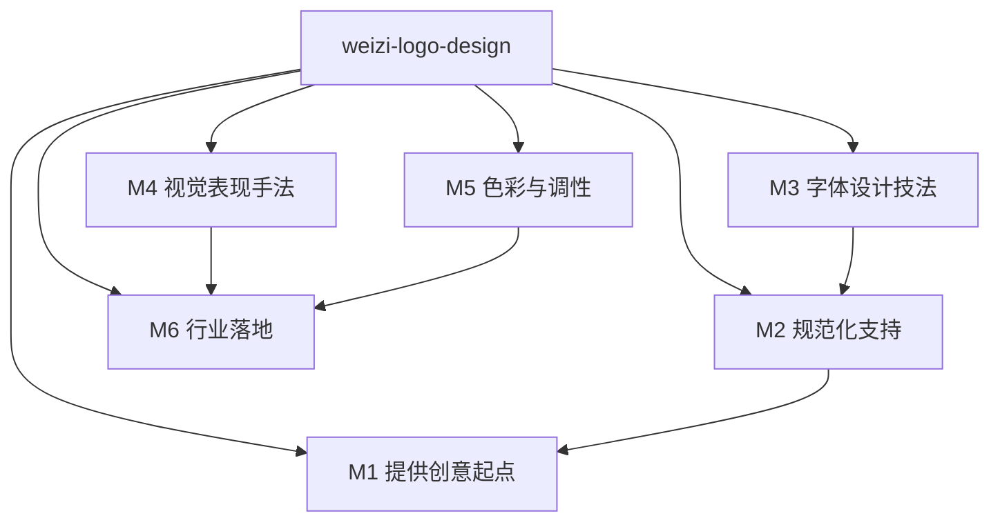

# INDEX — 维兹 logo 设计 skill 总览

> 阶段 3 (Zettelkasten 链接) 产物

## Skill 清单

| Skill | 定位 | 状态 |
|---|---|---|
| `weizi-logo-design` | 维兹式品牌标志设计（总流程 + 33 手法） | ✅ 完成 |

## 引用图

## 内部依赖关系

- M1（创意起点）→ M2（图形构造）→ M4（视觉表现）→ M6（商业落地）
- M3（字体）与 M2（图形）可独立或组合使用
- M5（色彩）作为收尾步骤，作用于任何结构

## 与外部 skill 的关系

- **composes-with doubao-creative-design**：先用本 skill 完成 logo 构思（名称特征+行业特征+手法+草图逻辑），再用图像生成工具出图
- **contrasts-with doubao-creative-design**：本 skill 专注"标志/商标/品牌符号"的维兹式方法论，非全品类视觉创意

## 审计

- 源：抖音「维兹logo设计」114 条视频
- 素材库：`D:\ZhangJing\weizi_logo_distill\素材库.md`
- 验证：33 单元通过三重验证
